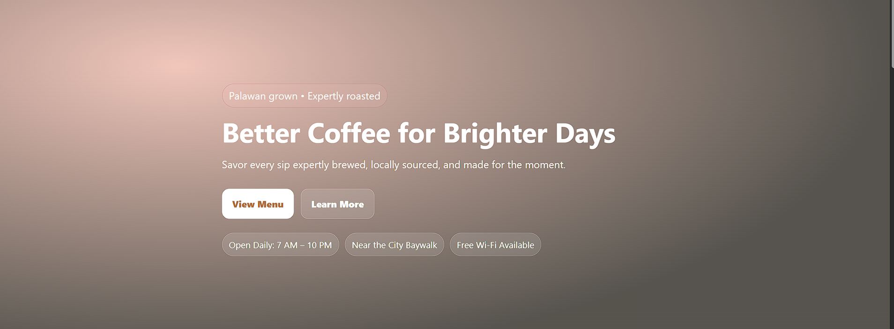
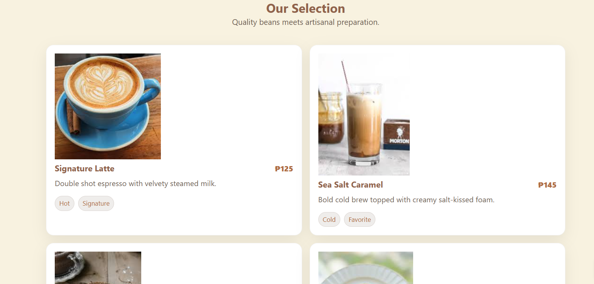

## Project Description

Cozy Cup Cafe is a professional, responsive web application designed for a local coffee shop in Puerto Princesa City. Inspired by the "Harbor Brews" concept, this project showcases a modern landing page that highlights Palawan-grown coffee, an interactive menu selection, and a streamlined contact system for the community. It aims to provide an inviting digital experience that reflects the warmth of a local cafe.

---

## Features

-Responsive Hero Section:** Features a high-impact landing area with a localized "Palawan grown" kicker and clear call-to-action buttons.
-Artisanal Menu Grid:** A clean, card-based layout displaying various coffee drinks and pastries with pricing and category tags.
-About & Statistics:** A dedicated section for the brand story, highlighting 100% Arabica beans and local sourcing from Baguio.
-Integrated Contact Form:** A user-friendly interface for inquiries, including physical address details and phone information.
-Accessibility First:** Implements "Skip to Content" links and semantic HTML to ensure all coffee lovers can navigate the site easily.

## Screen Captures

### Home Page

  

  The main landing area featuring the shop's tagline and navigation links to the menu and story.

---

### Menu Page

  

  A visual grid showing the Signature Latte, Sea Salt Caramel, and other fresh offerings.

---

### About Page

  

  A statistical breakdown of the cafe's quality standards and its reputation in Palawan.

---

### Contact Page

  

  The bottom area of the site where users can find the shop's location near the City Baywalk and send messages.

---

## About the Authors

**Name:Jazz Spencer G. Rosento
**Email:jazzspencerrosento@gmail.com

